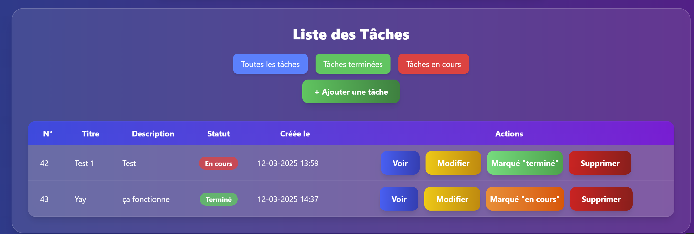
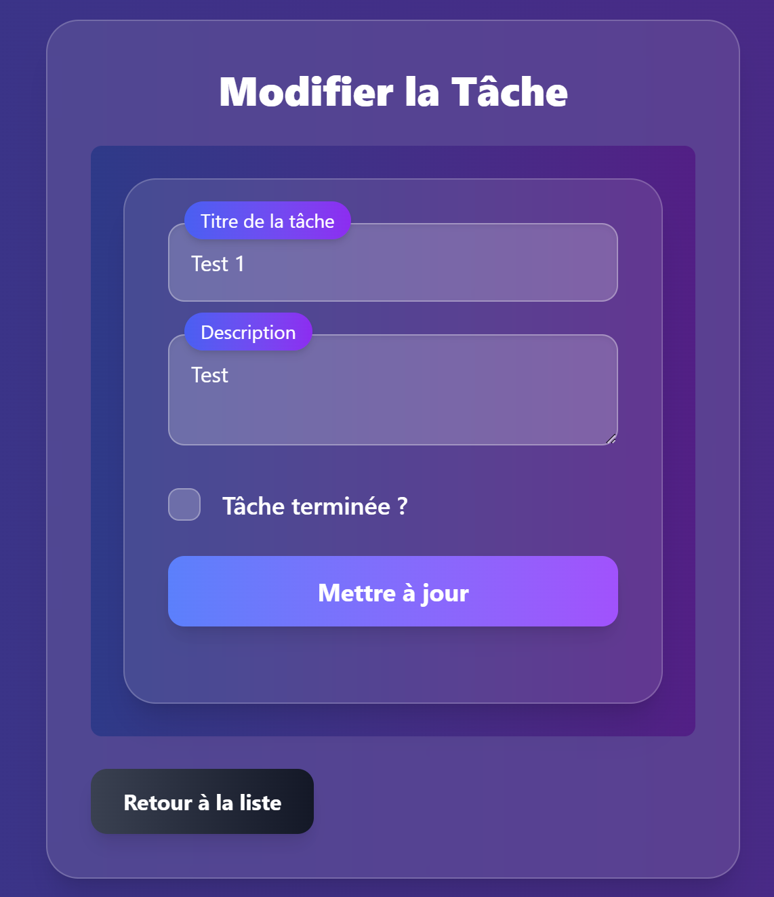
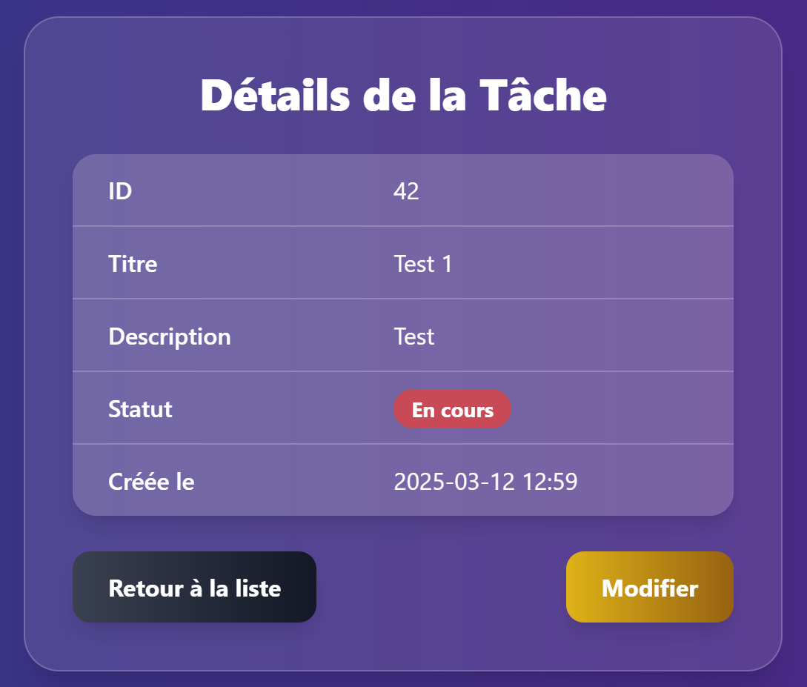
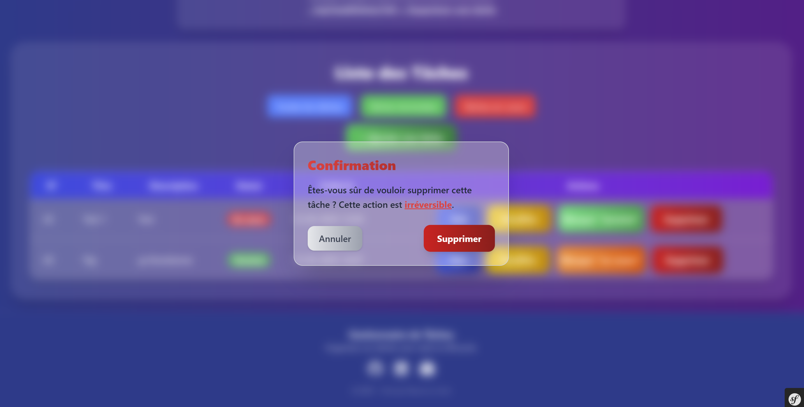

# Todo List Symfony avec Twig et Tailwind

## Description

Ce projet est une application de gestion de tâches (Todo List) construite avec Symfony et Twig. L'application permet aux utilisateurs de créer, marquer comme complètes et supprimer des tâches. L'interface est entièrement stylisée avec **Tailwind CSS**, intégré via un CDN.

## Fonctionnalités

- Ajouter une nouvelle tâche

- Marquer une tâche comme terminée

- Modifier une tâche

- Voir une tâche en particulier

- Supprimer une tâche


## Prérequis

Avant de commencer, vous devez avoir installé les éléments suivants :

- PHP >= 8.0
- Composer
- Symfony CLI (optionnel mais recommandé)
- Un serveur de base de données (par exemple, MySQL, SQLite)

## Installation

1. Clonez ce dépôt sur votre machine locale :

```bash
git clone https://github.com/StevenLeCamPro/ToDoApp.git
```

2. Accédez au dossier du projet :

```bash
cd ToDoApp
```

3. Installez les dépendances avec Composer :

```bash
composer install
```

4. Configurez votre fichier `.env` :

Ouvrez le fichier `.env` et configurez les variables d'environnement, par exemple pour MySQL :
(N'oubliez pas de rajouter votre mot de passe si besoin)

```
DATABASE_URL="mysql://root:@127.0.0.1:3306/todoapp?serverVersion=8.0.32&charset=utf8mb4"
```

5. Créez la base de données et les tables (si vous utilisez MySQL ou SQLite) :

```bash
php bin/console doctrine:database:create
php bin/console doctrine:schema:update --force
```

6. Lancez le serveur Symfony pour voir l'application en action :

```bash
symfony serve
```

L'application sera disponible à l'adresse suivante : [http://localhost:8000](http://localhost:8000).

## Structure du projet

- **src/** : Contient le code PHP, y compris les contrôleurs et les entités.
- **templates/** : Contient les fichiers de templates Twig pour l'interface utilisateur.
- **public/** : Contient les fichiers accessibles publiquement, y compris le fichier `index.php` et le dossier `assets` (images, CSS, etc.).
- **assets/** : Si vous décidez d'ajouter des fichiers JavaScript ou CSS personnalisés, vous pouvez les mettre ici.

## Technologie utilisée

- **Symfony** : Framework PHP pour développer l'application.
- **Twig** : Moteur de templates utilisé pour générer les vues.
- **Tailwind CSS (CDN)** : Framework CSS pour un design moderne et responsive.

## Personnalisation

### 1. Modifications du style
Bien que Tailwind CSS soit déjà inclus via le CDN dans le fichier `base.html.twig`, vous pouvez facilement personnaliser le style de l'application en modifiant les classes Tailwind dans les fichiers de templates Twig.

### 2. Fonctionnalités supplémentaires
Voici quelques fonctionnalités supplémentaires, telles qu'un CRUD via une API (disponble sur Postman ou Insomnia) :
(N'oubliez pas de rajouter localhost:8000 avant votre route et de choisir la bonne méthode)

- **Création d'une tâche** :  /api/taskCreate
- **Voir toutes les tâches** : /api/tasks
- **Voir une tâche en particulier** : /api/task/{id}
- **Modifier une tâche** : /api/taskUpdate/{id}
- **Supprimer une tâche** : /api/taskDelete/{id}

Voici la structure du fichier JSON pour créer une tâche :

```json
{
    "title": "texte",
    "description": "desc (optionnel)",
    "isDone": 0 ou 1
}
```

## Crédits

### Crédits de l'application
Cette application a été développée par Steven Le Cam en utilisant le framework Symfony ainsi que le moteur de template Twig et le framework Tailwind CSS. Si vous avez des questions ou des suggestions, n'hésitez pas à ouvrir une issue sur le dépôt GitHub du projet.
